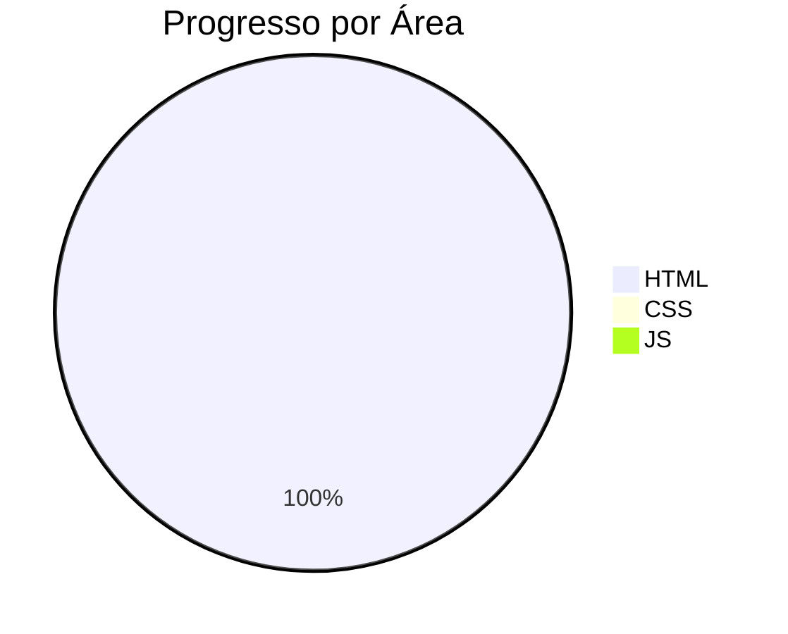

# Hoje não tem café 😔 Brincadeira 🤪

Um repositório para documentar minha jornada de aprendizado em HTML, desde os conceitos básicos até tópicos mais avançados.

## Sobre o Projeto

Este repositório serve como:
- 📖 Diário de estudos em HTML
- 🧪 Laboratório para experimentos com marcação web
- 📁 Organização de materiais de referência
- 🚀 Portfólio do meu progresso

## Tópicos que vou explorar

```html
✔️ Estrutura básica de um documento HTML
✔️ Tags fundamentais (headings, parágrafos, listas)
✔️ Formulários e inputs
✔️ Semântica HTML5
✔️ Acessibilidade
✔️ SEO básico
✔️ Integração com CSS e JavaScript
```
## 📊 Progresso Atual


## Como usar este repositório

1. Clone o repositório:
```bash
git clone https://github.com/Adryel0713/html-study-log.git
```

2. Explore as pastas por tópico ou data

3. Sinta-se à vontade para sugerir melhorias ou correções!

## Licença

[MIT](https://choosealicense.com/licenses/mit/)

---


"O conhecimento é a única coisa que quanto mais você compartilha, mais você tem!" ✨
